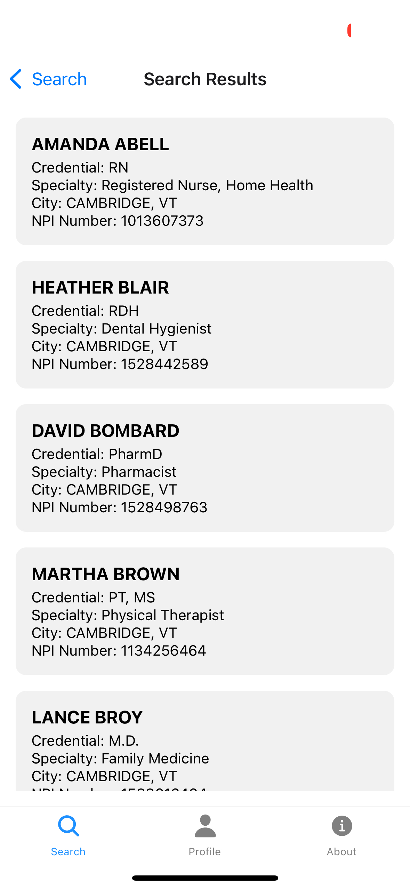
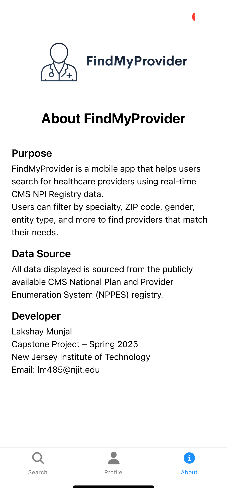

# FindMyProvider

FindMyProvider is a React Native app built using Expo. It allows users to search for healthcare providers based on specialty, ZIP code, radius, gender, language, and availability.

---

## 📱 Features

- User authentication (Sign In / Sign Up UI)
- Conditional navigation based on login state
- Bottom tab navigation for Search, Profile, and About
- Profile screen with editable info and sign-out button
- Search by Name or Specialty
- ZIP code + Radius filtering
- Gender & Language dropdown filters
- Accepting new patients toggle
- Search results with provider cards
- Provider details screen with icon sections and mock data
- Input validation & error handling
- “No results” screen
- About screen with app + developer info

---

## 📸 Screenshots

| Sign In | Sign Up | Search |
|---------|---------|--------|
|  |  |  |

| Results | Details | Profile | About |
|---------|---------|---------|--------|
|  |  |  |  |

---

## 🧰 Tech Stack

- React Native (Expo)
- React Navigation (Stack + Bottom Tabs)
- Mock data for Horizon Blue sandbox API
- Custom form components with validation and state management

---

## 🚀 How to Run Locally

1. Clone the repository:
```bash
git clone https://github.com/LakshayMunjal-dev/FindMyProvider.git
cd FindMyProvider
```

2. Install dependencies:
```bash
npm install
```

3. Start the app:
```bash
npm start
```

4. Scan QR in **Expo Go** or run in simulator.

---

## 👤 Developed By

**Lakshay Munjal**  
Capstone Project – Spring 2025  
New Jersey Institute of Technology

---

## 📄 Note

This app is developed for Capstone project academic purposes. API data is simulated based on Horizon BCBS sandbox schema due to lack of live provider data in their environment.